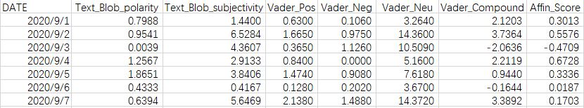
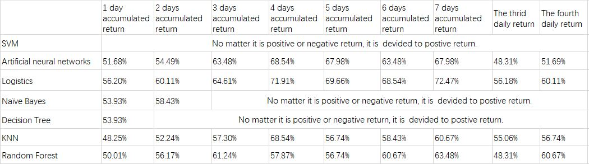

## Predict Positive or Negative Return of Bitcoin

In this part, we use the **machining learning** to explore and predict the negative or positive return of the incoming single day; and the return of holding Bitcoin for several accumulated days.

As the previous analysis, we know that the **sentiment classifier** we use, either Text Blob, Affin, or the Vader can not perform well to forecast the positive or the negative return of Bitcoin independently.

We want to see whether if we can use all these factors all together to predict. So we introduce the machining learning.

As for the **inputs**, in the chart, from our text analysis, we can see the seven sentiment features of our data set.



As for the **targets**, we would like to explore whether the seven sentiment features might be used to predict the accumulated return and the single daily return.

The accumulated return means that the return of holding the bitcoin for several days, and our task is to forecast whether the return is positive or negative; besides we short negative for N and short positive for P.


We used 10-fold cross-validation and test the traditional machining learning model, such as SVM, artificial neutral networks, logistics, naïve Bayes, decision tree, KNN and so on. 



We can see that Logistics and Artificial neural networks performs well in the prediction of accumulated return.

The below is about five days accumulated return by artificial neutral network.  And we can see the percent of correctly classified instances is over 67%.


### Machine Learning Application

Here is our code:
```javascript
import pandas as pd
ab=pd.read_csv('Data Analysis_Machine Learning_Five Days.csv')
feature_names = ['Text_Blob_polarity', 'Text_Blob_subjectivity', 'Vader_Pos', 'Vader_Neg','Vader_Compound','Affin_Score']
X = ab[feature_names]
y = ab['five_days_accumulated_return']

from sklearn.model_selection import train_test_split
X_train, X_test, y_train, y_test = train_test_split(X, y, random_state=0)

from sklearn.preprocessing import MinMaxScaler
scaler = MinMaxScaler()
X_train = scaler.fit_transform(X_train)
X_test = scaler.transform(X_test)

from sklearn.linear_model import LogisticRegression
logreg = LogisticRegression()
logreg.fit(X_train, y_train)
print('Accuracy of Logistic regression classifier on training set: {:.2f}'
    .format(logreg.score(X_train, y_train)))
print('Accuracy of Logistic regression classifier on test set: {:.2f}'
    .format(logreg.score(X_test, y_test)))

from sklearn.neighbors import KNeighborsClassifier
knn=KNeighborsClassifier()
knn.fit(X_train, y_train)
print('Accuracy of KNN classifier on training set: {:.2f}'
    .format(knn.score(X_train, y_train)))
print('Accuracy of KNN classifier on test set: {:.2f}'
    .format(knn.score(X_test, y_test)))

from sklearn.naive_bayes import GaussianNB
gnb=GaussianNB()
gnb.fit(X_train, y_train)
print('Accuracy of Bayes classifier on training set: {:.2f}'
    .format(gnb.score(X_train, y_train)))
print('Accuracy of Bayes classifier on test set: {:.2f}'
    .format(gnb.score(X_test, y_test)))

from sklearn.neural_network import MLPClassifier
mlpc=MLPClassifier(max_iter=10000)
mlpc.fit(X_train, y_train)
print('Accuracy of Neural network classifier on training set: {:.2f}'
    .format(gnb.score(X_train, y_train)))
print('Accuracy of Neural network classifier on test set: {:.2f}'
    .format(gnb.score(X_test, y_test)))

from sklearn.model_selection import cross_val_score
accuracy_logreg=cross_val_score(logreg,X,y,scoring='accuracy',cv=10)
print('Accuracy of Logistic regression classifier on 10-fold cross-validation:',accuracy_logreg.mean())

accuracy_knn=cross_val_score(knn,X,y,scoring='accuracy',cv=10)
print('Accuracy of KNN classifier on 10-fold cross-validation:',accuracy_knn.mean())

accuracy_gnb=cross_val_score(gnb,X,y,scoring='accuracy',cv=10)
print('Accuracy of Bayes classifier on 10-fold cross-validation:',accuracy_gnb.mean())

accuracy_mlpc=cross_val_score(mlpc,X,y,scoring='accuracy',cv=10)
print('Accuracy of Neural Network classifier on 10-fold cross-validation:',accuracy_mlpc.mean())
```

### Here comes our conclusion:

- From the result above, we can see the single sentiment polarity has relatively low relationship with all the returns.

- If we used the three sentiment polarity methods all together, Affin, Vader and Blob text and we used these sentiment score all as the inputs of machining learning method, we could predict the positive or negative return of 4-7 days accumulated return well.

- Besides, the correct rate is above **65%+**
